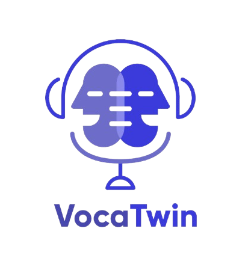

<div align="center">



# VocaTwin

**AI-Powered Voice Cloning & Animated Avatar Generation**

*Final Year Project — BS Software Engineering*

<br/>

[](https://flutter.dev)
[](https://flask.palletsprojects.com)
[](https://openrouter.ai)
[](https://firebase.google.com)
[](https://flutter.dev)
[](#license)

<br/>

> Clone your voice. Generate your avatar. Chat with AI.  
> VocaTwin is a full-stack mobile application combining voice cloning, face scanning, animated avatar generation, and an intelligent AI chatbot — all in one app.

</div>

---

## Table of Contents

- [Overview](#overview)
- [Features](#features)
- [Architecture](#architecture)
- [Tech Stack](#tech-stack)
- [Project Structure](#project-structure)
- [Getting Started](#getting-started)
- [Running the Backends](#running-the-backends)
- [Environment Variables](#environment-variables)
- [App Screens](#app-screens)
- [Team](#team)
- [Documentation](#documentation)

---

## Overview

VocaTwin was built as a Final Year Project to explore the convergence of **voice AI**, **computer vision**, and **mobile development**. The app allows users to:

1. **Record a 30-second voice sample** — a built-in audio visualizer shows real-time decibel levels as you speak
2. **Clone that voice** — the recording is sent to a custom Flask backend where AI synthesizes a cloned voice model
3. **Scan your face** — Google ML Kit detects your face in real time
4. **Generate an animated talking avatar** — your face and cloned voice are combined into a video avatar
5. **Chat with VocaTwinBot** — an AI assistant powered by **DeepSeek R1** that answers questions about the app and general topics

---

## Features

### 🎤 Voice Recording & Cloning
- Record up to 30 seconds of voice with a real-time animated waveform visualizer
- Pause, resume, and restart recordings
- Automatic codec selection (AAC on Android, WAV on iOS)
- Send recording to backend for AI voice cloning
- Save, rename, play back, and delete recordings locally

### 🤳 Face Scanning & Avatar Generation
- Live face detection using Google ML Kit
- Upload face photo + cloned voice to generate a talking avatar video
- Save generated avatar videos to Firebase Storage
- View all saved avatars in a dedicated gallery screen

### 🤖 VocaTwinBot (AI Chatbot)
- Powered by **DeepSeek R1** via OpenRouter API
- Intelligent responses about VocaTwin features and usage
- Suggestion chips for common questions on first open
- Shows response time for each reply
- Animated loading indicator ("bouncing dots") while waiting for response
- Optional live weather integration via OpenWeatherMap API

### 🔐 Authentication
- Email & Password login with Firebase Auth
- Google Sign-In
- Apple Sign-In
- Email verification flow
- "Remember Me" with SharedPreferences
- Change password from profile settings

### 👤 Profile & Settings
- Edit display name and profile picture
- View saved voice recordings
- View cloned voices
- View saved avatar videos
- Logout with session clear

---

## Architecture

```
┌─────────────────────────────────────────────┐
│              Flutter Mobile App              │
│  (Android / iOS — Dart + Firebase SDK)       │
│                                              │
│  ┌──────────┐  ┌──────────┐  ┌───────────┐  │
│  │  Auth    │  │  Voice   │  │  Chatbot  │  │
│  │ Firebase │  │ Cloning  │  │  Screen   │  │
│  └────┬─────┘  └────┬─────┘  └─────┬─────┘  │
└───────┼─────────────┼───────────────┼────────┘
        │             │               │
        ▼             ▼               ▼
  Firebase Auth   Flask API      Flask API
  Firestore       Voice Clone    Chatbot
  Storage         (Port 5000)    (Port 5001)
                       │               │
                       ▼               ▼
                  Voice Cloning   DeepSeek R1
                  AI Model        (OpenRouter)
```

---

## Tech Stack

| Layer | Technology |
|---|---|
| **Mobile Frontend** | Flutter 3.x (Dart) |
| **UI Components** | Material Design 3, Flutter Sound, Flutter Spinkit |
| **Authentication** | Firebase Auth (Email, Google, Apple) |
| **Database** | Cloud Firestore |
| **File Storage** | Firebase Storage |
| **Face Detection** | Google ML Kit Face Detection |
| **Chatbot Backend** | Flask (Python), DeepSeek R1 via OpenRouter |
| **Voice Clone Backend** | Flask (Python), custom AI voice synthesis |
| **Local Storage** | SharedPreferences, path_provider |
| **State Management** | setState (widget-level) |

---

## Project Structure

```
voca_twin_fyp/
│
├── 📁 lib/                            Flutter app source
│   ├── main.dart                      App entry point & MaterialApp setup
│   ├── routes.dart                    Named route definitions
│   ├── firebase_options.dart.example  Firebase config template
│   │
│   ├── 📁 screens/
│   │   ├── 📁 auth/
│   │   │   ├── login_screen.dart      Email/Google/Apple login
│   │   │   ├── signup_screen.dart     New account registration
│   │   │   └── verify_email_screen.dart
│   │   │
│   │   ├── 📁 main/
│   │   │   ├── home_screen.dart       Dashboard with recent voices
│   │   │   ├── voice_cloning_screen.dart  30s recorder + waveform visualizer
│   │   │   ├── chatbot_screen.dart    VocaTwinBot chat UI
│   │   │   ├── face_scan_screen.dart  ML Kit face detection
│   │   │   ├── avatar_screen.dart     Avatar generation & playback
│   │   │   ├── cloned_voices_screen.dart
│   │   │   ├── audio_selection_screen.dart
│   │   │   ├── synthesize_screen.dart
│   │   │   └── ...
│   │   │
│   │   ├── 📁 profile/
│   │   │   ├── edit_profile_screen.dart
│   │   │   ├── change_password_screen.dart
│   │   │   ├── profile_settings_screen.dart
│   │   │   └── saved_avatars_screen.dart
│   │   │
│   │   └── 📁 microphone/
│   │       └── recent_played_screen.dart
│   │
│   ├── 📁 services/
│   │   ├── auth_service.dart          Firebase auth wrapper
│   │   ├── chatbot_service.dart       HTTP calls to chatbot backend
│   │   ├── voice_cloning_service.dart HTTP calls to voice clone backend
│   │   ├── avatar_service.dart        Avatar generation logic
│   │   ├── api_service.dart           Shared HTTP utilities
│   │   └── ai_service.dart            Gemini AI integration (optional)
│   │
│   ├── 📁 widgets/
│   │   ├── custom_bottom_navbar.dart
│   │   ├── custom_button.dart
│   │   └── voice_card.dart
│   │
│   └── 📁 utills/
│       ├── constants.dart             API URLs, color constants
│       ├── theme.dart                 App-wide theme
│       ├── validators.dart            Form validators
│       └── helpers.dart
│
├── 📁 backend/
│   ├── 📁 chatbot/                    DeepSeek R1 chatbot API
│   │   ├── app.py                     Flask server — POST /chat (port 5001)
│   │   ├── chatbot.py                 CLI test client
│   │   ├── requirements.txt
│   │   └── .env.example
│   │
│   └── 📁 voice_clone/               Voice synthesis API
│       ├── app.py                     Flask server — POST /clone (port 5000)
│       ├── requirements.txt
│       └── .env.example
│
├── 📁 docs/
│   ├── VocaTwin_Documentation.pdf     Full project documentation
│   └── VocaTwin_Presentation.pptx    Defense presentation slides
│
├── 📁 assets/images/                  App images & logo
├── 📁 android/app/
│   └── google-services.json.example  Firebase Android config template
├── pubspec.yaml                       Flutter dependencies
└── .gitignore
```

---

## Getting Started

### Prerequisites

Make sure you have the following installed:

- [Flutter SDK](https://flutter.dev/docs/get-started/install) `>=3.6.0`
- [Android Studio](https://developer.android.com/studio) or [VS Code](https://code.visualstudio.com/) with Flutter extension
- [Python 3.9+](https://www.python.org/downloads/)
- A [Firebase project](https://console.firebase.google.com/) with **Auth**, **Firestore**, and **Storage** enabled

### 1. Clone the Repository

```bash
git clone https://github.com/TahaUser5/voca-twin.git
cd voca-twin
```

### 2. Set Up Firebase

1. Go to [Firebase Console](https://console.firebase.google.com/) → Your project → Project Settings → Android
2. Download `google-services.json`
3. Place it in `android/app/google-services.json`
4. Copy and fill in your Firebase config:

```bash
cp lib/firebase_options.dart.example lib/firebase_options.dart
# Edit firebase_options.dart with your project values
```

### 3. Install Flutter Dependencies

```bash
flutter pub get
```

### 4. Run the App

```bash
# Make sure an Android emulator or device is connected
flutter run
```

---

## Running the Backends

Both backends must be running for full functionality. Open **two separate terminals**.

### Chatbot Backend (Port 5001)

```bash
cd backend/chatbot

# Create and activate virtual environment
python -m venv venv
venv\Scripts\activate        # Windows
# source venv/bin/activate   # macOS/Linux

# Install dependencies
pip install -r requirements.txt

# Set up environment
cp .env.example .env
# Add your OPENROUTER_API_KEY to .env

# Start the server
python app.py
# ✅ Running at http://localhost:5001
```

### Voice Clone Backend (Port 5000)

```bash
cd backend/voice_clone

python -m venv venv
venv\Scripts\activate

pip install -r requirements.txt

cp .env.example .env

python app.py
# ✅ Running at http://localhost:5000
```

---

## Environment Variables

### `backend/chatbot/.env`

| Variable | Required | Description |
|---|---|---|
| `OPENROUTER_API_KEY` | ✅ Yes | Get from [openrouter.ai/keys](https://openrouter.ai/keys) — used to call DeepSeek R1 |
| `OPENWEATHER_API_KEY` | ❌ Optional | Get from [openweathermap.org](https://openweathermap.org/api) — enables live weather replies |
| `VOCATWIN_API_URL` | ❌ Optional | Default: `http://localhost:5001` |

### `backend/voice_clone/.env`

| Variable | Required | Description |
|---|---|---|
| `VOICE_CLONE_API_URL` | ❌ Optional | Default: `http://localhost:5000` |

> ⚠️ **Security:** Never commit `.env` files. They are excluded in `.gitignore`. Use the provided `.env.example` files as templates.

---

## App Screens

| Screen | Description |
|---|---|
| **Onboarding** | Intro slides for first-time users |
| **Login / Signup** | Firebase auth with Email, Google & Apple |
| **Email Verification** | Sends verification link before allowing access |
| **Home** | Dashboard with quick action cards and recent recordings |
| **Voice Cloning** | 30s recorder with live waveform, pause/resume/restart |
| **Audio Added** | Confirmation screen after recording with upload option |
| **Synthesize** | Select text and voice for synthesis |
| **Face Scan** | Real-time face detection using ML Kit |
| **Avatar** | Generate and play animated talking avatar video |
| **Chatbot** | Full chat UI with VocaTwinBot (DeepSeek R1) |
| **Cloned Voices** | Library of all previously cloned voice models |
| **Saved Avatars** | Gallery of all generated avatar videos |
| **Recent Played** | Recently played audio recordings |
| **Profile Settings** | Edit name, photo, and account settings |
| **Edit Profile** | Change display name and profile picture |
| **Change Password** | Secure password update via Firebase |

---

## Team

<table>
  <tr>
    <td align="center"><b>👑 Muhammad Muzamil</b><br/>Founder &amp; UI Lead<br/><sub>App design, Flutter frontend, project management</sub></td>
    <td align="center"><b>🚀 Taha Tanvir</b><br/>Co-Founder &amp; Flutter Expert<br/><sub>Flutter development, API integration, backend connectivity</sub></td>
    <td align="center"><b>🎓 Najaf Ali</b><br/>Project Supervisor<br/><sub>Academic guidance &amp; project oversight</sub></td>
  </tr>
</table>

---

## Documentation

Full project documentation and the defense presentation are available in the [`docs/`](./docs/) folder:

| File | Description |
|---|---|
| [`VocaTwin_Documentation.pdf`](./docs/VocaTwin_Documentation.pdf) | Complete project report including system design, methodology, and results |
| [`VocaTwin_Presentation.pptx`](./docs/VocaTwin_Presentation.pptx) | Final year defense presentation slides |

---

## License

This project was developed as a **Final Year Project** for BS Software Engineering.  
© 2025 VocaTwin Team — Muhammad Muzamil & Taha Tanvir. All rights reserved.

---

<div align="center">

Made with ❤️ using Flutter, Flask & DeepSeek AI

⭐ If you found this project useful, give it a star!

</div>
